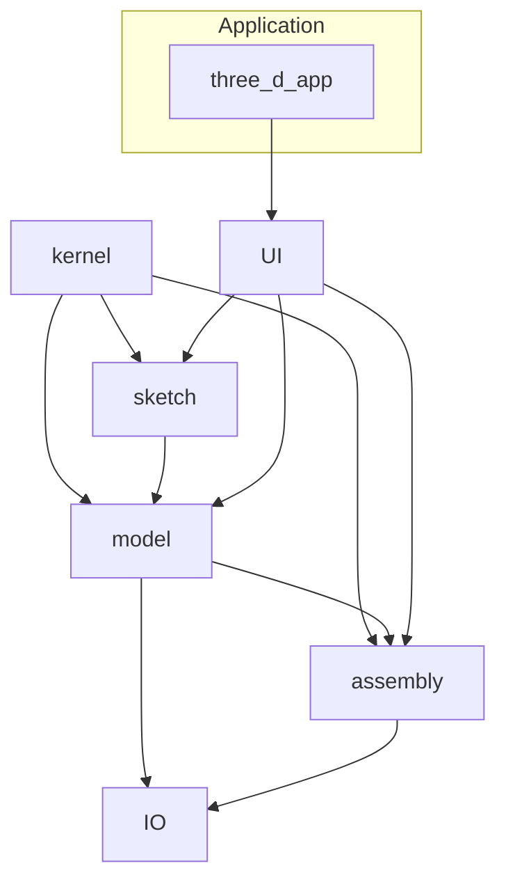

# Architecture

This project is organized into modular libraries that together form a minimal 3D CAD environment. The top-level executable `three_d_app` links all modules:

- **kernel** – core math and mesh operations (vector/matrix types, boolean ops, mesh builders, mass properties).
- **sketch** – 2D sketching system with geometric entities and a constraint solver.
- **model** – feature-based modeling (extrude, revolve, fillet, chamfer) built on kernel geometry. Includes a history tree and materials.
- **assembly** – manages components and applies mates between them (AxisMate, PlaneMate) to define relationships.
- **io** – import/export of native `.cadproj` and common formats such as OBJ, STL and STEP.
- **ui** – ImGui-based user interface providing viewport rendering and property panels.

## Relationships

- `sketch` and `model` rely on the geometric foundations provided by `kernel`.
- `model` consumes sketches to create features and exposes geometry to `assembly` and `io`.
- `assembly` organizes multiple models and applies mates using kernel mathematics.
- `io` serializes models and assemblies to various file formats.
- `ui` drives user interaction and invokes sketch, model and assembly operations.
- `three_d_app` ties everything together by linking all modules.



## Build Instructions

The project uses CMake to generate build files. From the repository root:

```bash
cmake -S . -B build
cmake --build build
ctest --test-dir build
```

All modules are built as static libraries and linked into the `three_d_app` executable. Tests live under the `tests/` directory and can be executed with `ctest` as shown above.
