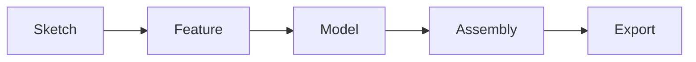

# User Manual

This project provides a minimal 3D CAD toolchain for experimenting with sketching, parametric features, and simple assemblies.

## Building

The project uses CMake. To configure, build, and run tests:

```bash
cmake -S . -B build
cmake --build build
ctest --test-dir build
```

## Running

After building, launch the main application:

```bash
./build/three_d_app
```

### Sketcher

- Choose **Sketch Mode** in the UI or run the `sketch_view` demo.
- Use the line and circle tools to place entities.
- Apply constraints such as coincident, perpendicular, or equal length.
- Press **Solve** to run the constraint solver and update geometry.

### Feature Creation

- Use a completed sketch as the profile for features.
- Create an **Extrude** or **Revolve** feature and adjust its parameters.
- Modify features using operations like **Fillet** or **Chamfer** to refine edges.
- The history tree updates when features change.

### Assembly Mates

- Insert models as components into an assembly.
- Constrain components using mates:
  - **AxisMate** aligns two component axes.
  - **PlaneMate** makes planar faces coincident.
- Solving mates positions components relative to each other.

### User Interface

The UI uses ImGui and provides:

- A **viewport** for 3D navigation.
- A **property panel** for editing feature and mate parameters.
- Menu options to switch modes, import/export models, and run the solver.

### Workflow Overview


